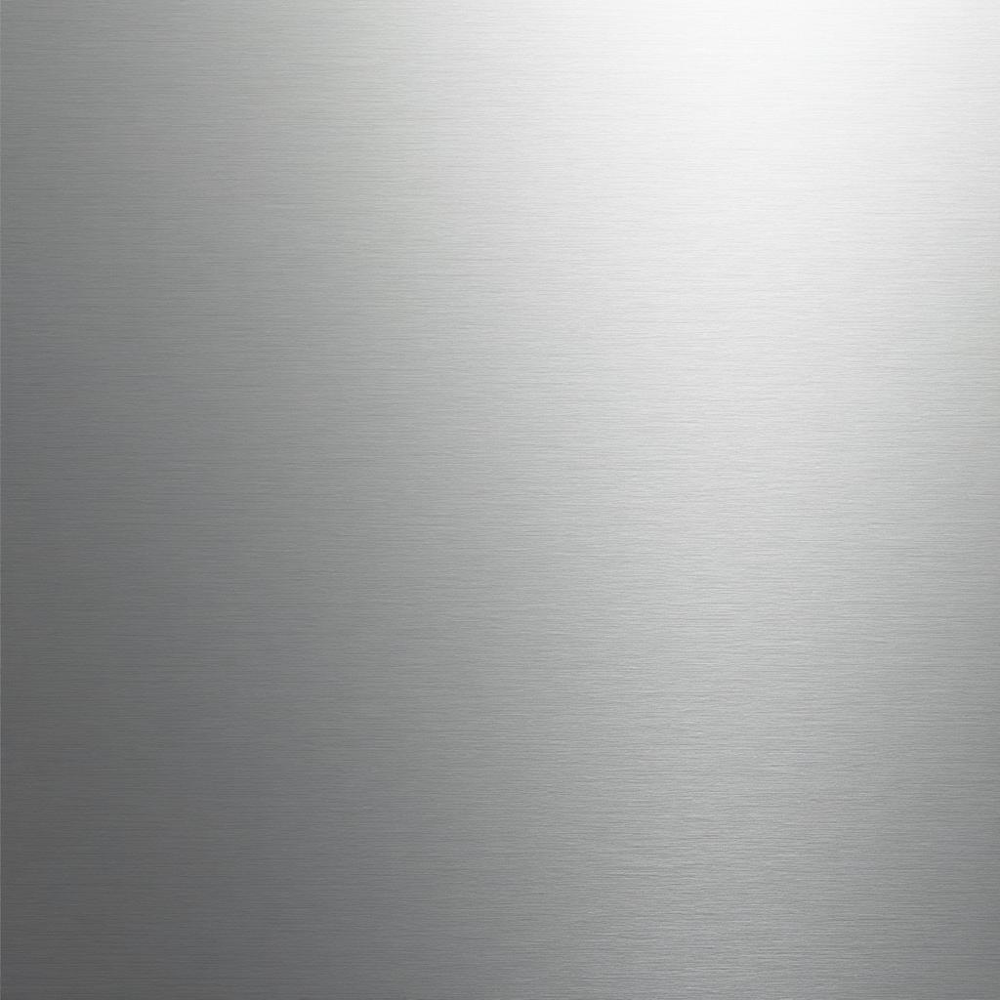

# Gravity — AI-Native Advertising Platform

> **Where individual value meets aligned incentives.**

Gravity is an AI-native ad platform that transforms LLM conversations into a premium native ad channel. One platform, two faces: **Publishers** unlock hidden revenue in their conversations, **Advertisers** unlock precision timing in intent-driven moments.



---

## 🚀 Quick Start

```bash
# Install dependencies
npm install

# Start development server
npm run dev

# Build for production
npm run build
```

---

## 📖 What is Gravity?

### The Core Story

Gravity turns AI conversations into a native ad channel by inserting high-intent sponsored suggestions directly inside LLM answers—without breaking trust.

**For Publishers:** Integrate Gravity. Suggestions flow naturally. Revenue flows automatically.  
**For Advertisers:** Gravity places you at the exact moment of high intent—when users are asking, comparing, deciding.

### The Duality Philosophy

Two audiences, one fundamental truth: **AI conversations are the new ad channel.**

- Publishers unlock hidden value in their conversations
- Advertisers unlock precision timing in intent-driven moments
- Same platform. Opposite sides of the same transaction.

Visual language makes this immediately clear: **split but seamless.**

---

## 🎨 Design System — "Cosmic Hardware"

### The Aesthetic

Think **Stripe meets TRON meets premium Apple hardware**. Not sci-fi theater—sci-fi precision.

| Element | Direction |
|---------|-----------|
| **Surfaces** | Matte, brushed metal. Not glossy. Depth through shadow, not shine. |
| **Motion** | Micro-interactions that feel inevitable, not decorative. |
| **Density** | Let things breathe. |
| **Color Accents** | Orange for Publishers, Teal for Advertisers |

### Animation Philosophy

#### Golden Rules

1. **No animation without purpose** — Every motion answers: "Why does this move?"
2. **Easing is everything** — Linear kills premium feel. Use custom cubic-bezier curves.
3. **Timing is musical** — Stagger creates rhythm. Rhythm makes it feel alive.
4. **Parallax is subtle** — Paraform-style restraint.
5. **Hover is reactive, not predictive** — Don't anticipate; respond.

#### Animation Techniques

- **Logo scroll band:** Opposite directions, continuous loop, pause on hover
- **Dual cards:** Fade + scale in, hover lift + shadow, subtle parallax on scroll
- **How It Works:** Step-by-step animations, each step fades in as you scroll into view
- **CTA sections:** Slight background shift (orange glow for publisher, teal for advertiser) on hover
- **Form transitions:** Smooth toggle between Publisher/Advertiser modes, field animation on tab switch

#### Performance Checklist

- ✅ GPU Acceleration (`transform`, `opacity`, `will-change`)
- ✅ Mobile Optimization (touch-friendly, reduced motion support)
- ✅ 60fps target on all animations
- ✅ Lazy-load heavy animations below fold

---

## 🗂️ Site Structure

### Pages

| Route | Description |
|-------|-------------|
| `/` | Homepage — Hero, How It Works, Dual Cards, CTAs |
| `/publishers` | Publisher-focused landing page |
| `/advertisers` | Advertiser-focused landing page |
| `/demo` | Book a demo form (toggle between Publisher/Advertiser) |
| `/join` | Join/signup flow |

### Key Sections

#### Hero Section
- Rotating headline showcasing dual value proposition
- Cosmic background with subtle particle effects
- Primary CTAs: "Become a Publisher" / "Explore Advertiser Placements"

#### How It Works
```
Headline: "The conversation is the context. Gravity is the engine."
```

**Step 1: Conversations Happen**
> Your users are already having high-intent conversations.
> Asking, comparing, deciding. Every prompt is a data point about what they actually want.

**Step 2: Gravity Activates**
> When the moment is right, Gravity surfaces a native, high-intent sponsored suggestion
> that feels like the LLM's own insight. Not a banner. Not an ad. A suggestion.

**Step 3: Value Unlocks**
> Publishers get revenue. Advertisers get precision. Users get helpful suggestions
> they actually want. Gravity makes all three things happen simultaneously.

#### Publisher CTA Section (Orange accent)
```
Headline: "Your conversations are worth something."
Body: You built the space where conversations happen. We built the engine
      to turn them into revenue—without compromising UX or user trust.
CTA: Become a Publisher →
```

#### Advertiser CTA Section (Teal accent)
```
Headline: "Your buyers are having conversations right now."
Body: High-intent moments happen in LLM chats, not just search. Be there.
      Gravity reaches users at the exact second they're deciding.
CTA: Explore Advertiser Placements →
```

#### Footer Structure

| For Publishers | For Advertisers | Company |
|----------------|-----------------|---------|
| How it works | Formats | About |
| Pricing | Inventory | Blog |
| Docs | Reporting | Careers |
| Case studies | FAQ | Contact |

---

## 💬 Messaging Framework

### Publisher Messaging
- **Problem:** "Your conversations are full of commercial intent, but you're not capturing that value."
- **Solution:** "Integrate Gravity. Suggestions flow naturally. Revenue flows automatically."
- **Outcome:** "Higher RPM. Same UX. No technical debt."

### Advertiser Messaging
- **Problem:** "Your buyers are in LLM conversations, but you can't reach them there."
- **Solution:** "Gravity places you at the exact moment of high intent—when they're asking, comparing, deciding."
- **Outcome:** "Higher CTR. Lower CAC. Cleaner attribution."

### Unified Messaging
> "We connect creators (publishers) with buyers (advertisers) at the precise moment value is created."

---

## 📦 Integration SDKs

### Available Now

| SDK | Installation | Docs |
|-----|--------------|------|
| **TypeScript** | `npm i @iris-technologies/api` | [npm](https://www.npmjs.com/package/@iris-technologies/api) |
| **React/Next.js** | `npm i @iris-technologies/react` | [npm](https://www.npmjs.com/package/@iris-technologies/react) |

### Coming Soon
- Python SDK
- iOS SDK (Swift/Objective-C)
- Android SDK (Kotlin/Java)
- React Native SDK

All SDKs include:
- Comprehensive documentation and examples
- Type-safe APIs with full IDE support
- Ready-to-use components and utilities
- Performance optimization best practices

---

## ❓ FAQ Reference

### Platform Integration
- **How easy is it to integrate?** — Just a few lines of code with comprehensive documentation
- **What platforms are supported?** — Web (React, Vue, Angular), iOS, Android, server-side (Node.js, Python)

### LLM Integration
- **How does Gravity preserve the conversational experience?** — AI-powered context analysis injects relevant suggestions without breaking flow
- **What LLM platforms work with Gravity?** — Any LLM-based platform: chatbots, AI assistants, search engines, content generation tools

### DSP Integration
- **How do DSPs connect?** — Standard OpenRTB 2.6 integration
- **What targeting is available?** — Advanced contextual targeting based on real-time conversation analysis, user intent signals, semantic understanding

### Monetization
- **Revenue model:** Revenue-sharing with real-time bidding
- **Typical expectations:** Higher CPMs than traditional display due to contextual nature and strong intent signals
- **Reporting:** Transparent, real-time dashboard with monthly payments

### Privacy & Compliance
- **Privacy:** Built with privacy-by-design, GDPR and CCPA compliant
- **Brand safety:** AI screening, granular controls over ad categories
- **No personal data:** Advanced NLP understands context without tracking users

---

## 🛠️ Tech Stack

| Technology | Purpose |
|------------|---------|
| **Vite** | Build tool & dev server |
| **React 18** | UI framework |
| **TypeScript** | Type safety |
| **Tailwind CSS** | Styling |
| **shadcn/ui** | Component library |
| **Framer Motion** | Animations |
| **React Router** | Routing |

---

## 📁 Project Structure

```
src/
├── assets/           # Images, logos, textures
├── components/       # React components
│   ├── ui/          # shadcn/ui components
│   ├── navigation/  # Nav components
│   ├── campaign/    # Campaign management
│   └── onboarding/  # Onboarding flow
├── hooks/           # Custom React hooks
├── lib/             # Utilities
├── pages/           # Page components
└── index.css        # Global styles
```

---

## 🎯 Development Guidelines

### Component Philosophy
- **Animations everywhere** — Make this feel production-grade and slick
- **Mobile-first** — Critical that everything is optimized for mobile
- **Performance obsessed** — GPU-accelerated animations, lazy loading
- **Accessibility** — Reduced motion support, keyboard navigation

### Visual Principles
- Duality that's actually unity (Publisher ≠ Advertiser, but one system)
- Premium, restrained, purposeful — no noise, all signal
- The aesthetic is "Cosmic Hardware" — Stripe meets TRON meets Apple

---

## 📝 License

Proprietary — Gravity / Iris Technologies

---

## 🔗 Links

- **Website:** [gravity.ai](https://gravity.ai) *(placeholder)*
- **TypeScript SDK:** [npm](https://www.npmjs.com/package/@iris-technologies/api)
- **React SDK:** [npm](https://www.npmjs.com/package/@iris-technologies/react)

---

*Built with precision. Designed for the future of AI-native advertising.*
